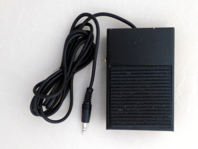

# vacuum pump controller

[](https://raw.githubusercontent.com/koendv/vacuum-pump-controller/master/images/vacuum_pump_controller_with_sensor_big.jpg)

This is a controller for a vacuum pump, useful in pick-and-place machines. The controller adjusts the rpm of a vacuum pump to maintain a constant vacuum. The controller can be used over usb, as part of a pick-and-place machine, or standalone, with a footswitch.

## Features:

- up to 4 x BMP280 pressure sensors: 1 for outside pressure, 1 for vacuum pressure, and 2 for two pick-and-place nozzles. The pressure sensors on the nozzles are used to check whether a component has been picked up or fallen off.

- up to 2 x 12V solenoid valve, one for each pick-and-place nozzle.

## Usage

Plug the controller in a usb port, and connect to the usb serial port. On linux, this is ``minicom -D /dev/ttyACM0``

Hit the reset button to see the boot message:

```
vacuum controller - type h for help
sensors ok  ok  -  -
ready
>
```
The ``sensors`` line indicates sensor status:

- ``ok`` sensor detected and running
- ``-`` no sensor detected
- ``?`` bmp280 unresponsive, or sensor is wrong type (not bmp280)

Every command is briefly described.

#### h - Help

 ``h`` *help* prints a command summary:

```
>h
commands, ## = int, #.## = float:
? print status
s#.## setpoint
p#.## proportional gain
i#.## integral gain
d#.## derivative gain
m#.## manual mode
a autotune
l## logging on/off
v## valve on/off
w write settings
r reset
f firmware
h help
>
```

All commands are a single character, optionally followed by a number, and terminated with *enter*.

#### ? - print status

```
>?
vacuum hPa: 99.97 motor: 73.60% mode: auto
setpoint hPa: 100.00 Kp: 150.00 Ki: 50.00 Kd: 0.00 logging: 0
pressure hPa: 938.86 838.89 939.41 0.00
sensors ok  ok  ok  -
```
In this case, there are three sensors. The first sensor measures atmospheric pressure; the second sensor measures the pressure in the vacuum vat; the third measures the pressure at the nozzle. The vacuum is the difference between the first and the second sensor. All pressures are in hPa. Atmospheric pressure is around 1000 hPa.

*vacuum* is the measured value. *motor* is PWM, in percent. *mode* is *auto* if running the PID controller; *manual* if the motor PWM has been set using the ``m`` command.

The vacuum pump controller is a PID controller. *setpoint* is the
desired value; *Kp*, *Ki* and *Kd* are controller proportional, integral and derivative gain. It is normal for *Kd* to be zero. If *logging* is non-zero, pressure is logged on the console every 0.1s.

*pressure* is the pressure from the four sensors, in hPa. If a sensor is not plugged in, the pressure is 0.

Lastly, *sensors* is the sensor state. If a sensor says ``?``, check the cable, check the sensor is plugged in right, or power cycle the board.

#### s - Setpoint

The *setpoint* command sets the desired vacuum, in hPa.
```
>s100.0
ok
```

#### p - Proportional Gain

Sets the PID controller Kp.
```
>p150.0
ok
```

#### i - Integral Gain

Sets the PID controller Ki.
```
>i50.0
ok
```

#### d - Derivative Gain

Sets the PID controller Kd. Usually zero.

```
>d0
ok
```

#### l - Logging

Switches logging on or off.

- ``l0`` logging off.
- ``l1`` logging on.

Use the ``w`` command if you want this setting to be saved.

When logging is on, every sample is printed on the console output, in one line, e.g.:
```
        1743075 52417   93876   83764   93926   0       2067058
```
The fields are:
- time since boot in milliseconds
- motor PWM; a value from 0 to 65535.
- pressure of sensor 1, 2, 3, 4 in Pa.
- a checksum that is the 32 bit sum of the 6 previous numbers.
This format can be imported in a spreadsheet.

The line begins with a tab character, and numbers are separated by a tab character. If you parse console output, check for lines that begin with a tab.

#### Valve

Switches outputs BO1 and BO2 on/off. These outputs are normally connected to solenoid valves.

- ``v00`` switch BO1 off
- ``v01`` switch BO1 on
- ``v10`` switch BO2 off
- ``v11`` switch BO2 on

#### Manual

Sets the motor PWM manually. Value is a number from 0 to 100, inclusive.

- ``m100`` full speed
- ``m0`` stop
- ``m`` return to automatic mode

#### Autotune

*Autotune* measures the step response. From this measurement values for Kp, Ki and Kd are calculated using [lambda tuning](https://www.controleng.com/articles/fundamentals-of-lambda-tuning/)

```
>a
autotune - press c to cancel
cycle 1/5
  0%    0 hPa
 11%    1 hPa
100%  131 hPa
  0%    0 hPa
100%   83 hPa
minpwm: 7141 maxpwm: 65535 minpressure: 0.49 maxpressure: 130.83
tau: 2.69s Kp: 149.34 Ki: 55.54
...
Kp: 149.60 Ki: 54.03 Kd: 0.00
enter w to save
```

After *autotune*, if the calculated settings seem correct, use ``w`` to store these settings in non-volatile memory. If you choose not to save, the old settings will be restored after the next reset or power cycle.

Run *autotune* again if the system has changed, firmware has been updated, a different vacuum pump or vacuum vessel has been installed.

#### Write
The ``w`` write command saves Kp, Ki, Kd, setpoint, and logging to non-volatile memory. The saved values will be restored on power-up.

```
>w
ok
```

#### Reset
The ``r`` reset command reboots the controller.

```
>r
vacuum controller - type h for help
sensors ok  ok  ok  -
ready
>
```

#### Firmware
The ``f`` command prints the compilation date and ram usage.
```
>f
compiled May 24 2021
11312 bytes free
13 ms slowest loop
```

### Manual Controller Tuning

If, instead of autotune, you wish to *manually* tune the controller, try the following:

- set Kp, Ki, Kd to 0
- increase Kp until the system oscillates. Set Kp to half this value.
- increase Ki until the system oscillates. Set Ki to half this value.

The result will not be optimal, but ought to work. Autotune is preferred.

### Connections

Connect pressure sensors, vacuum pump, and solenoid valve.

#### Sensors

Up to 4 BMP280 boards can be connected in headers H1..H4.

- H1: air pressure
- H2: pressure inside vacuum vessel
- H3: optional, pressure at nozzle 1
- H4: optional, pressure at nozzle 2

The minimal configuration is sensors at H1 and H2. There is no need to calibrate the sensors; the sensors are calibrated at the factory.

#### Vacuum Pump
 Connect a 12V DC brushless vacuum pump. Maximum current of the TB6612 driver is 1A continuous.

 If the vacuum pump has two wires:

 - red (+) to AO1
 - black (-) to GND

 If the vacuum pump has four wires:

 - red (+) to 12V
 - black (-) to GND
 - PWM input to AO1
 - Tacho output does not need to be connected

On a Parker D1001-23-01 vacuum pump, wire colors are: red 12V, black ground, white PWM, blue tacho. Check datasheet before connecting.

#### Solenoid valve

Connect the first solenoid valve:

 - red (+) to B01
 - black (-) to GND

If there is a second solenoid valve, connect:

 - red (+) to B02
 - black (-) to GND

### Footswitch

[](https://raw.githubusercontent.com/koendv/vacuum-pump-controller/master/images/footswitch_big.jpg)

Sometimes a small, standalone tool is preferred. The optional footswitch can be used to switch the first solenoid valve on and off.

The footswitch connects using a 3.5mm TRRS jack. Solder a cable from an old mobile phone earset to an SPDT footswitch. Connections are:

- Tip: NO Normally open
- Ring1: NC Normally closed
- Ring2: unused
- Shield: Common

The console prints ``footswitch`` when a footswitch is detected.

## Display


The display is a yellow/blue oled display, 128x64, SPI, SSD1306 controller. The display is optional; the controller also works without display. The display shows pump, sensors, and vacuum:

- The bargraph at the top shows the pump motor. The larger the bar graph, the harder the motor works.

- Next up to four rectangles, one for each sensor that is plugged in. If the rectangle is blue, the sensor is ok; if the rectangle is yellow there is a problem.

- At the bottom the vacuum in hPa. The vacuum is the difference between the first and the second sensor.

To the right there is a small square that blinks slowly to show the display works.

## Hardware

[](https://raw.githubusercontent.com/koendv/vacuum-pump-controller/master/images/vacuum_pump_controller_big.jpg)

The board is built around an STM32F103 *Blue Pill*. The microcontroller reads the pressure from the BMP280 sensors, runs a PID controller algorithm, and sets PWM on a TB6612FNG driver to control the speed of the vacuum pump.

- [schematic](doc/schematic.pdf)
- [pcb top](doc/pcb_top.pdf)
- [pcb bottom](doc/pcb_bottom.pdf)
- [easyeda/oshw project](https://oshwlab.com/koendv/vacuum-pump-controller).

The board is 2 layer, 55 x 55 mm.

### Bill of Materials

Off-the-shelf parts:

| | description |
|---|---|
|1 | [STM32F103xx](https://www.aliexpress.com/item/32525208361.html) controller board, 128kbyte flash.
|4 | [BMP280 3.3V pressure sensor "GY-BMP280-3.3"](https://www.aliexpress.com/item/4000587263474.html)
|1 | [TB6612FNG dual motor driver](https://www.aliexpress.com/item/32978024026.html)
|1 | [OLED 128x64, SPI, 7pin, SSD1306, yellow/blue](https://www.aliexpress.com/item/32638662748.html)
|1 | DC005 DC jack
|1 | PJ-320A 3.5 mm audio jack, 4 pin, through-hole
|1 | 47u/25V capacitor

FDM 3D-printed parts:

- 3 x pressure sensor housing

## Sensors

[](https://raw.githubusercontent.com/koendv/vacuum-pump-controller/master/images/sensor_assembly_big.jpg)

The pressure sensor consists of a GY-BMP280-3.3 module, sealed inside a 3d-printed housing.

The housing has been designed using OpenSCAD. [OpenSCAD sources and STL files](openscad/).

The tube is 6mm outside diameter, 4 mm inside diameter PU. Housing is sealed using silicone rubber. After applying the silicone rubber, wet your finger in liquid dishwasher detergent to gently push the silicone rubber into shape.

Test the sensor works *before* you seal the housing.

When looking at the GY-BMP280-3.3 pressure sensor module, the contacts are, from left to right: SDO, CSB, SDA, SCL, GND, VCC.

## Software

The software is an Arduino sketch, compiled with the STM32duino board support package. Sources are available on [git](https://github.com/koendv/vacuum-pump-controller/tree/main/arduino/vacuumcontroller). There's also a backup of the Arduino libraries used.

## Firmware

You can compile and upload the firmware from the Arduino IDE, or use the pre-compiled binaries and upload from the command line. To upload the firmware:

- set Blue Pill jumper BOOT0 to 1, BOOT1 to 0.
- reset or power cycle the Blue Pill
- connect a usb-serial converter to header H5, pins GND, TXD, RXD.
- upload the firmware.
    - If using the Arduino IDE, choose *Sketch->Upload*.
    - If uploading from the command line, use ```/usr/bin/stm32flash -g 0x8000000 -b 115200 -w vacuumcontroller.ino.bin /dev/ttyUSB0```, replacing USB0 with the device of the usb-serial converter.
- set Blue Pill jumper BOOT0 to 0, BOOT1 to 0.
- reset or power cycle the Blue Pill

With the firmware installed, led of the Blue Pill ought to flash briefly every 5 seconds. Also, the console of the vacuum controller ought to appear as a usb serial port, on linux typically ``/dev/ttyACM0``.

## Download

Download Gerbers for pcb manufacturing, stl files for 3d printing, and firmware for the microcontroller from [releases](releases)

## Links

- [oshw project page](https://oshwlab.com/koendv/vacuum-pump-controller)
- [developer notes](README_DEVELOPER.md)
