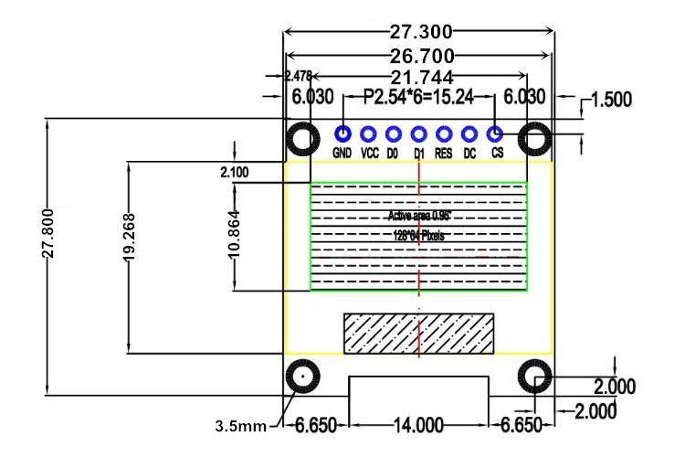

# Box

Box for vacuum pump controller. Print the files [box_top.stl](box_top.stl) and [box_bottom.stl](box_bottom.stl). Ream the screw holes with an M3 wood drill. Use nylon M3 screws and nuts to join controller pcb, box top and bottom. Snip off screws that are too long.

The oled display used has these dimensions:

